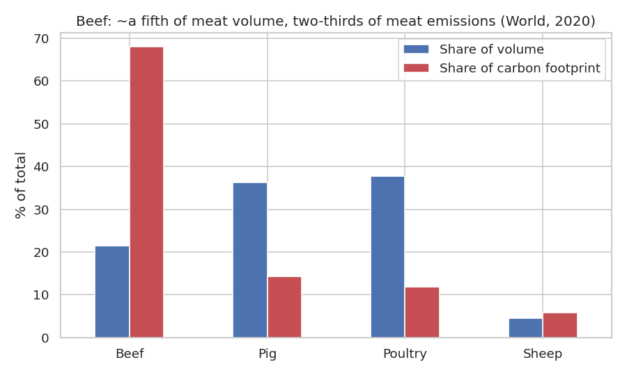
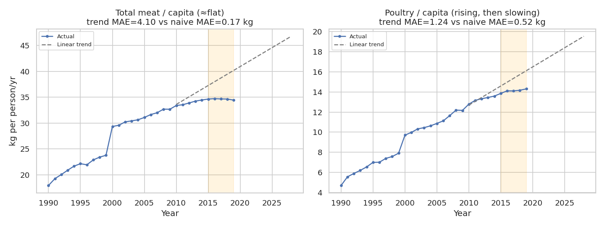
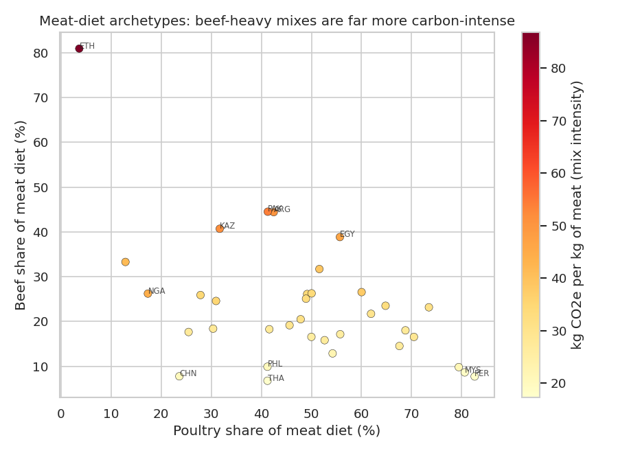

# The Carbon Footprint of Meat Demand
### An animal-protein supply-chain sustainability analysis

How the changing **mix** of global meat demand - not just the total - drives greenhouse-gas emissions, and where the most practical levers for a lower-carbon animal supply chain lie.

This project takes real-world demand data, builds a transparent **emissions-footprint metric**, and uses it to surface trends, segment countries, sanity-check a forecast, and quantify one actionable supply-chain lever. Modelling choices are validated against simple baselines, and data limitations are stated explicitly throughout.

---

## Key findings

- **Composition beats quantity.** In 2020, **beef was ~21% of world meat volume but ~68% of the meat carbon footprint**.
- **The poultry shift is real and helpful.** Per-capita meat is roughly flat; the structural move toward poultry (≈10× less carbon-intense per kg than beef) lowers average intensity.
- **Diet archetypes differ ~2×** in carbon per kg of meat eaten (≈27 kg CO₂e/kg for poultry-led mixes vs ≈59 for beef/sheep-led mixes).
- **Models must be benchmarked.** A naive "same as last year" baseline **beat** a linear-trend forecast for these smooth series - reported honestly rather than forced into a "model wins" story.
- **A clear lever:** shifting **25% of world beef volume to poultry → ~15% lower** meat footprint.



---

## Data

| Dataset | File | Origin | Used for |
|---|---|---|---|
| Meat consumption | `data/oecd_meat.csv` | OECD–FAO Agricultural Outlook (earlier edition), via a public GitHub mirror - see note below | Consumption by country, year (1990–2028) and type (beef, pig, poultry, sheep), in kg/capita & thousand tonnes |
| CO₂ & GHG | `data/owid_emissions_subset.csv` | Our World in Data - [owid/co2-data](https://github.com/owid/co2-data) | National methane / population for an independent cross-check |

> **Source note:** the meat figures originate from the OECD–FAO Agricultural Outlook (the OECD "meat consumption" indicator). They were **not** pulled from the official OECD portal - the CSV used here comes from a public community mirror ([mystichronicle/meat-consumption-dataset-analysis](https://github.com/mystichronicle/meat-consumption-dataset-analysis)) and reflects an earlier edition of the outlook (projections run to 2028). For anything beyond this portfolio exercise, source the current data directly from OECD/FAO.

**Emission factors** - mean life-cycle GHG per kg of product, from **Poore & Nemecek (2018, *Science*)** via Our World in Data: beef 99.5, lamb & mutton 39.7, pig 12.3, poultry 9.9 kg CO₂e/kg.

> These are **global meta-analysis means**. Real intensity varies widely by production system and region, so results are a defensible **first-order** comparison of the *mix*, not a per-country inventory. See *Limitations*.

---

## Method

1. **Clean & reshape** the tidy OECD meat table into per-measure wide frames; separate countries from aggregate regions.
2. **EDA** - per-capita consumption trends by type (the poultry shift).
3. **Footprint metric** - `footprint = volume × emission factor`; compare each product's share of *volume* vs share of *footprint*.
4. **Clustering** (k-means) - group countries by meat-mix shares into diet archetypes; compare mix intensity (CO₂e/kg) and per-capita footprint.
5. **Forecast + baseline** - linear trend vs naive last-value, validated on a held-out 2015–2019 window.
6. **Scenario** - quantify a beef→poultry substitution.
7. **Multi-source cross-check** - meat-diet intensity vs OWID national methane (correlational).




---

## Run it

```bash
pip install -r requirements.txt

# Option A - reproduce all figures/results from the script
python analysis.py

# Option B - open the narrative notebook (recommended)
jupyter notebook meat_carbon_footprint_analysis.ipynb
```

Outputs land in `figures/` and `data/`.

---

## Repo structure

```
.
├── meat_carbon_footprint_analysis.ipynb   # narrative analysis (executed, with outputs)
├── analysis.py                            # same analysis as a standalone script
├── README.md
├── LICENSE
├── requirements.txt
├── data/                                  # inputs + generated artifacts
└── figures/                               # generated charts
```

---

## Limitations

- **Emission factors are global means** - real intensity varies hugely by production system/region (the variation that on-the-ground sustainability work exists to measure).
- **Consumption ≠ production** - trade means a country's consumption footprint differs from what it produces; this is a demand-side view.
- **Coverage** - OECD–FAO covers major economies, not every country; aggregate regions were excluded from country-level analysis.
- **The methane cross-check is correlational** - methane has many non-livestock sources (rice, waste, fossil fuels).

## What I'd do next

- Per-country, per-system emission factors (e.g. FAO GLEAM / IPCC tiers) instead of global means.
- Split production vs consumption using trade data for a true supply-chain footprint.
- Add land and water use alongside GHG.
- Reframe forecasting as **scenario modelling** on demand drivers (income, population, prices) rather than naive extrapolation.

---

*Data: OECD–FAO Agricultural Outlook (meat, via a public GitHub mirror); Our World in Data (emissions). Emission factors: Poore & Nemecek (2018), Science.*
